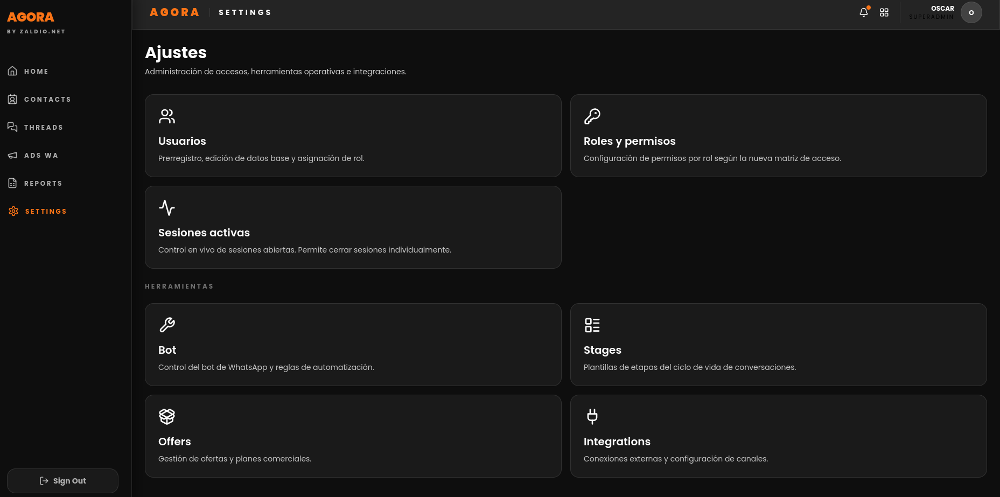

# Agora Platform

Monorepo operativo para una plataforma modular de atencion, automatizacion y control de conversaciones. Integra panel web, backend transaccional, autenticacion, WebSocket en tiempo real, WhatsApp, Meta Inbox, n8n y servicios auxiliares de IA/OCR.

## Vista del panel



## Version
- Actual: `v1.4.1`
- Fecha: `2026-05-14`

La evolución de cambios se documenta en `CHANGELOG.md`.

## Estructura

```
app/
  agora/            # frontend React, api-backend-nest (NestJS), websocket (Socket.IO)
  accesos/          # abackend: autenticacion, usuarios, roles, permisos
  wa-backend/       # bridge WhatsApp/Baileys
  env/              # templates de configuracion por perfil

n8n/
  docker-compose.yml
  whisper/          # STT (solo usado por n8n)
  tesseract/        # OCR (solo usado por n8n)
  env/              # templates de configuracion por perfil

scripts/            # operacion del stack por perfil
ops/                # docs operativos, runbooks
```

Servicios externos al repo (operan independientemente):
- Postgres, Redis, Nginx Proxy Manager — cada uno con su propio compose en el host

## Configuracion publica
Este repositorio publica solo el codigo y templates de configuracion.

- Los archivos `app/env/*.env` y `n8n/env/*.env` son templates con placeholders.
- Cada despliegue completa su propia capa de configuracion segun el entorno.
- Los datos persistentes como `uploads`, sesiones WhatsApp, dumps, certificados y volumenes de BD quedan fuera del arbol versionado.

## Operacion rapida
1. Copiar el template del perfil que corresponda:

```bash
cp app/env/dev.local1.env app/env/dev.local1.secrets.env
cp n8n/env/dev.local1.env n8n/env/dev.local1.secrets.env
# completar *.secrets.env con valores reales
```

2. Inicializar `.env` privados por servicio si faltan:

```bash
./scripts/init-service-envs.sh
```

3. Validar y levantar el perfil:

```bash
./scripts/verify-env.sh dev.local1
./scripts/verify-compose.sh dev.local1
./scripts/up-profile.sh dev.local1
```

## Documentacion
- `README-OPERACION.md`: guia principal de operacion por perfil.
- `CHANGELOG.md`: historial de releases.
- `ops/RUNBOOKS.md`: guía operativa de referencia rápida (bootstrap, deploy, rollback, Vault).
- `ops/docs/`: matriz de ambientes, diseño técnico y documentos de referencia internos.

## Licencia

El código propio de este repositorio es propietario y confidencial. Ver `LICENSE`.

Dependencias de terceros incluidas o referenciadas, cada una bajo su propia licencia:

| Componente | Licencia | Restricción relevante |
|---|---|---|
| [Baileys](https://github.com/WhiskeySockets/Baileys) | GPL-3.0 | Distribución de código que lo use debe ser GPL-3.0 |
| [n8n](https://github.com/n8n-io/n8n) | Sustainable Use License | No puede ofrecerse como servicio gestionado a terceros |
| [Whisper](https://github.com/openai/whisper) | MIT | Sin restricciones relevantes |
| [Tesseract](https://github.com/tesseract-ocr/tesseract) | Apache 2.0 | Requiere atribución |
